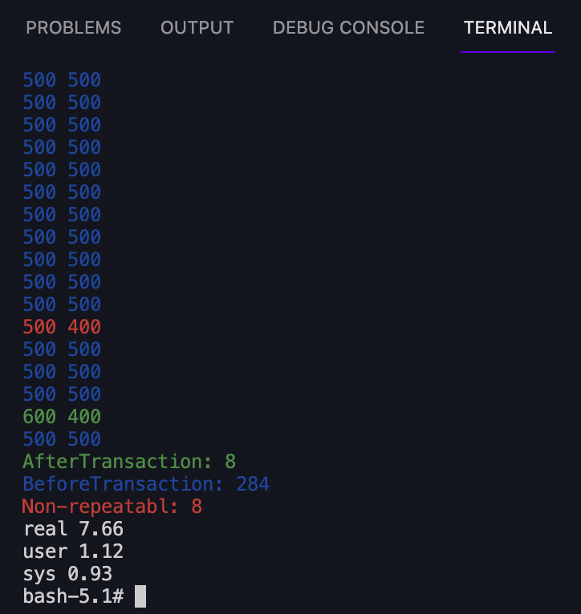
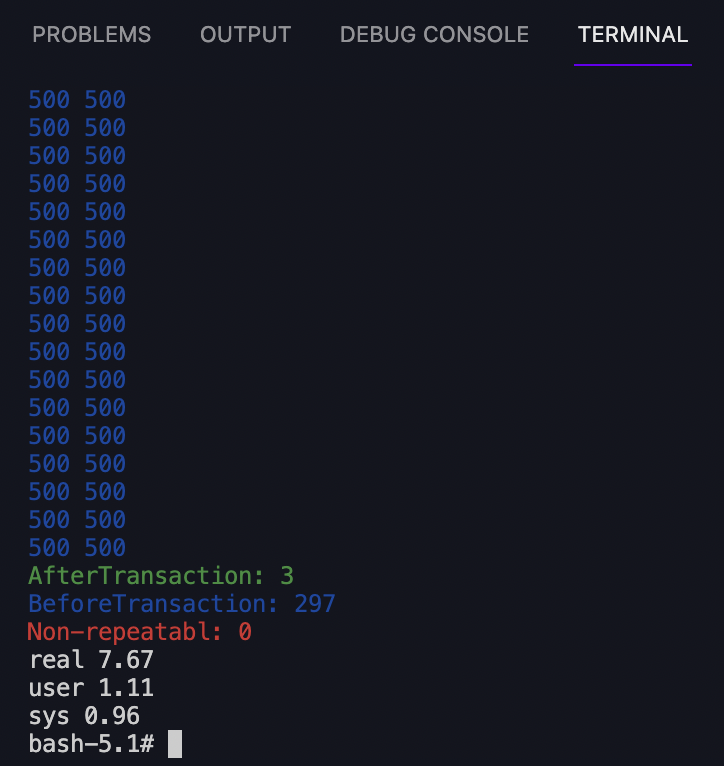

# First Try Transaction Isolation

Article:

## Usage

```sh
sudo docker-compose up -d
sudo docker exec -ti pg bash
sh non-repeatable-read/start.sh
```

## lab's result with isolation level

### Read committed



### Repeatable Read


